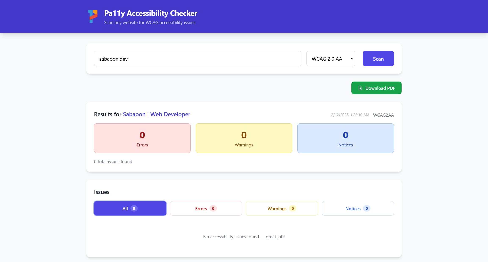
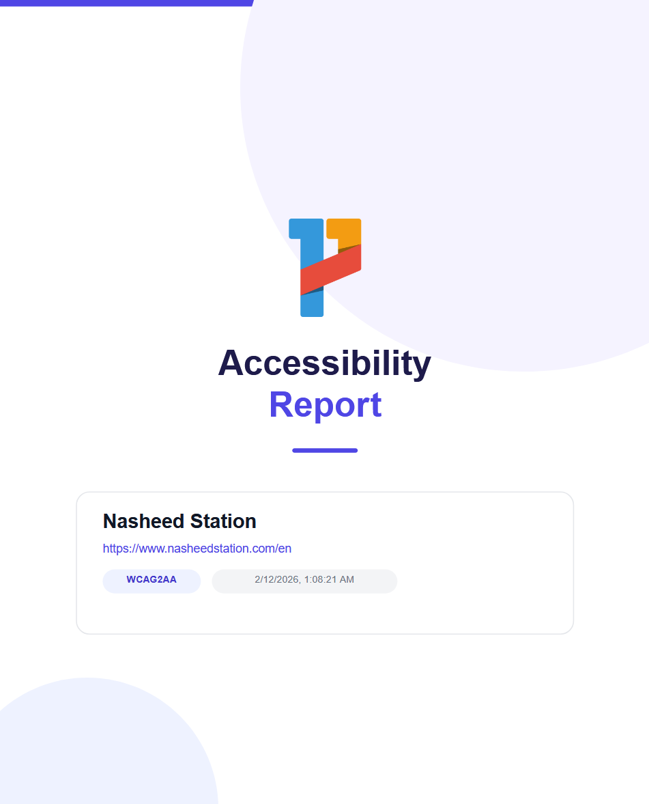

# Pa11y React Accessibility Scanner

A web accessibility checker powered by [pa11y](https://github.com/pa11y/pa11y). Scan any website for WCAG accessibility issues and download a styled PDF report.

Inspired by [pa11y-dashboard](https://github.com/pa11y/pa11y-dashboard) and [pa11y-webservice](https://github.com/pa11y/pa11y-webservice).


## Screenshots

### App — Scan results with filterable issues


### PDF Report


## Features

- Scan any URL for WCAG 2.0 Level A, AA, or AAA compliance
- View results with error/warning/notice counts and filterable issue list
- Download styled PDF accessibility reports
- No database required — runs scans on-demand
- Auto-prepends `https://` if no protocol is provided

## Tech Stack

| Layer    | Tech                        |
| -------- | --------------------------- |
| Frontend | React 19, Vite, Tailwind CSS |
| Backend  | Express, pa11y, PDFKit      |
| Browser  | Headless Chromium (via Puppeteer) |

## Getting Started

### Prerequisites

- [Node.js](https://nodejs.org/) 20+
- Chrome/Chromium (downloaded automatically by Puppeteer)

### Installation

```bash
git clone https://github.com/sabaoongfx/pa11y-react-checker.git
cd pa11y-react-checker
npm run install:all
```

### Run

```bash
npm run dev
```

This starts both servers:

- **Frontend** — http://localhost:5173
- **Backend** — http://localhost:4000

Open http://localhost:5173 in your browser, enter a URL, pick a WCAG standard, and hit Scan.

## API Endpoints

| Method | Endpoint         | Description                     |
| ------ | ---------------- | ------------------------------- |
| POST   | `/api/scan`      | Run accessibility scan          |
| POST   | `/api/scan/pdf`  | Run scan and return PDF report  |

### POST `/api/scan`

```json
{
  "url": "https://example.com",
  "standard": "WCAG2AA"
}
```

Returns JSON with `url`, `standard`, `documentTitle`, `counts`, and `issues` array.

### POST `/api/scan/pdf`

Same request body. Returns a PDF file download.

## Project Structure

```
pa11y-react-checker/
├── client/                  # React + Vite + Tailwind
│   ├── src/
│   │   ├── components/
│   │   │   ├── Header.jsx
│   │   │   ├── UrlForm.jsx
│   │   │   ├── ResultsSummary.jsx
│   │   │   ├── IssueCard.jsx
│   │   │   └── IssueList.jsx
│   │   ├── App.jsx
│   │   └── main.jsx
│   └── public/              # Pa11y logo, favicon
├── server/
│   ├── index.js             # Express + pa11y + PDFKit
│   └── pa11y-logo.png       # Used in PDF reports
├── package.json
├── LICENSE
└── README.md
```

## PDF Report

Generated reports include:

- Cover page with Pa11y logo, page title, URL, WCAG standard, and date
- Summary page with color-coded stat blocks (errors, warnings, notices)
- Full issue list with type badges, messages, selectors, and HTML context

## Contributing

Contributions are welcome! Please open an issue or submit a pull request.

1. Fork the repo
2. Create your branch (`git checkout -b feature/my-feature`)
3. Commit your changes (`git commit -m 'Add my feature'`)
4. Push to the branch (`git push origin feature/my-feature`)
5. Open a Pull Request

## License

[MIT](LICENSE) — built by [sabaoon.dev](https://sabaoon.dev)
